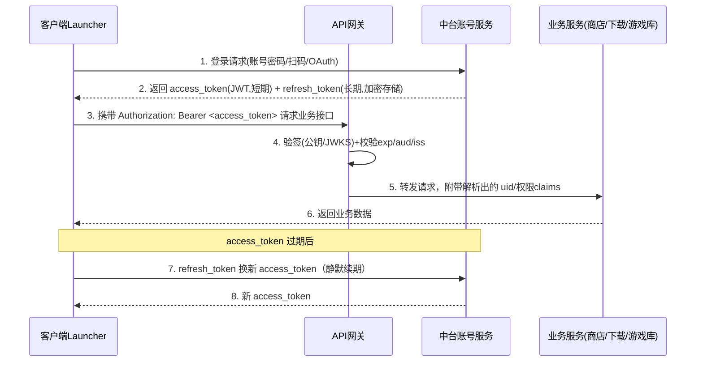
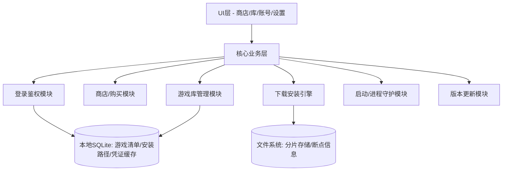
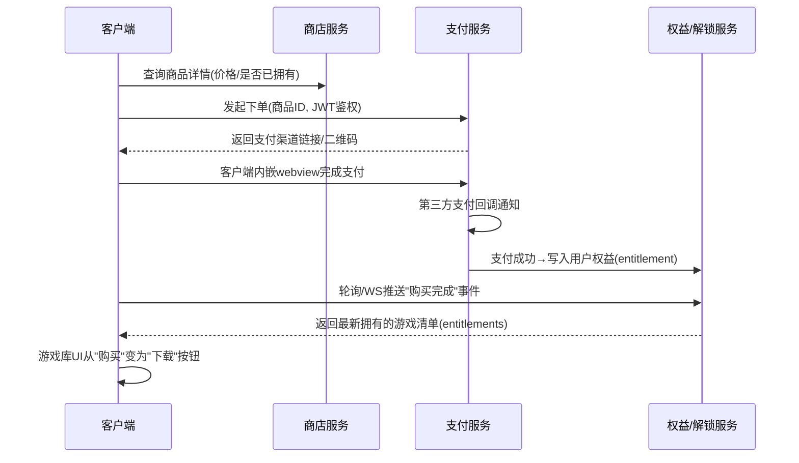
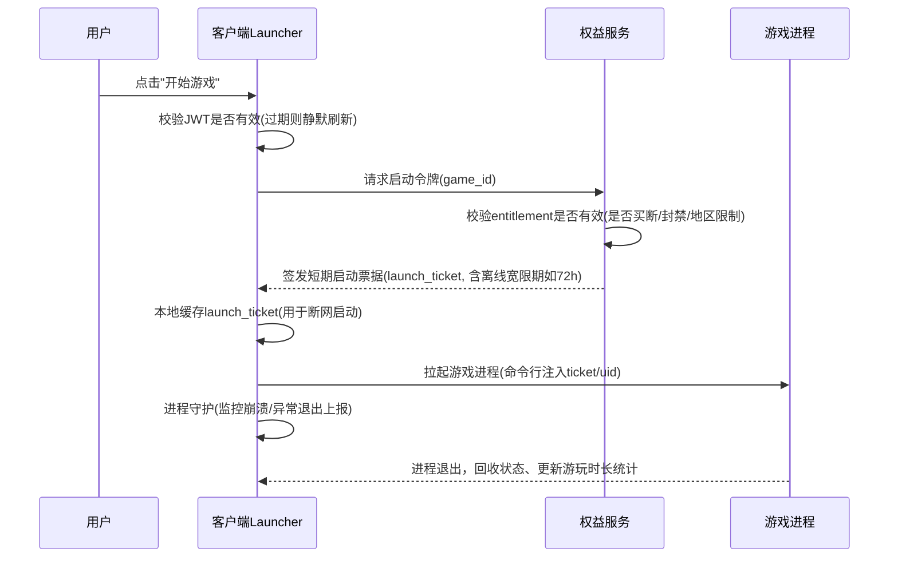

# 游戏聚合平台客户端设计（类 Battle.net）

下面给出一套完整的架构与流程设计，覆盖客户端、后端服务、统一登录（中台JWT）、购买解锁、下载安装、启动、卸载等核心链路。

## 一、总体架构

```
┌─────────────────────────────────────────────────────────┐
│                      客户端 Launcher                      │
│  (Electron/Qt/自研C++ UI)                                 │
│  登录模块 | 商店模块 | 游戏库模块 | 下载引擎 | 进程管理 | 更新模块 │
└───────────────┬─────────────────────────────────────────┘
                │ HTTPS / WSS
┌───────────────▼─────────────────────────────────────────┐
│                      API 网关 (Gateway)                    │
│   鉴权拦截(JWT校验) / 限流 / 路由                            │
└───┬──────┬──────────┬──────────┬──────────┬─────────────┘
    │      │          │          │          │
┌───▼──┐┌──▼───┐  ┌───▼────┐ ┌───▼─────┐┌───▼──────┐
│中台   ││商店/ │  │授权/   │ │下载分发  ││游戏库/   │
│账号   ││商品  │  │DRM服务  │ │CDN服务   ││资产元数据│
│认证   ││服务  │  │(解锁令牌)│ │         ││服务      │
│(SSO/  │└──────┘  └────────┘ └─────────┘└──────────┘
│JWT)   │
└───────┘
    │
┌───▼─────────────────────────────────────┐
│  订单/支付服务 (第三方支付网关对接)          │
└───────────────────────────────────────────┘
```

**设计要点**：登录鉴权与业务系统解耦——中台只负责签发/刷新 JWT，其余服务（商店、下载、DRM）都作为“资源服务器”，只做 JWT 校验+权限判断，不重复实现登录逻辑。

---

## 二、统一登录：中台 JWT 方案

### 1. 认证流程



### 2. Token 设计

| 项 | access_token | refresh_token |
|---|---|---|
| 生命周期 | 15~30分钟 | 7~30天（可滑动续期） |
| 存储位置 | 内存 | 客户端本地加密存储（DPAPI/Keychain/自研AES+设备指纹） |
| 载荷(claims) | uid, region, device_id, roles, iat/exp/iss/aud | 仅jti+uid，服务端存储映射用于吊销 |
| 签名算法 | RS256/ES256（非对称，业务服务用JWKS公钥验签，无需连中台） | 同上，但仅中台自己校验 |
| 吊销 | 无状态，靠短过期时间兜底 | 服务端维护黑名单/白名单表，支持强制下线、封号 |

**关键设计**：
- **单点登录/多端互踢**：refresh_token 关联 device_id，中台维护"当前有效设备"列表，实现挤下线。
- **本地免登录**：客户端保存 refresh_token（加密），启动时静默换取 access_token；换取失败才弹出登录界面。
- **离线宽限期**：断网时允许已下载游戏在"授权令牌"有效期内启动（见下方DRM部分），避免必须联网才能玩。

---

## 三、客户端模块划分



- **UI层**：商店（浏览/搜索/详情/购买）、我的游戏库（已购/已装/可下载）、账号中心、设置（下载限速、安装路径）。
- **核心业务层**：与UI解耦，通过事件总线/状态管理（如Redux/MobX 或 C++侧的观察者模式）驱动UI刷新。
- **本地数据库**：记录游戏元数据缓存、安装状态机、下载进度断点，离线也能展示"我的库"。

---

## 四、购买解锁流程



**权益模型（entitlement）**是核心抽象：一条记录 `{uid, game_id, sku, source(购买/赠送/免费领取), 有效期(买断=永久), 状态}`。下载/启动前都要查这张表，而不是直接信任本地缓存——防止改本地文件绕过购买。

---

## 五、下载安装引擎

### 状态机

```
未拥有 → 已拥有(可下载) → 下载中 → 已暂停 → 安装中 → 已安装(可启动) → 需更新 → 已安装
                                                              ↓
                                                           已卸载(可重新下载)
```

### 关键技术设计

1. **分片下载 + CDN**：游戏包切分为固定大小chunk（如4MB），支持多线程并发下载、断点续传、CDN多节点调度（就近节点+失败自动切换）。
2. **增量更新（Patch）**：不重新下载整包，采用二进制diff（如bsdiff/自研rolling-hash分块比对，类似rsync算法），只下载变化的chunk。
3. **完整性校验**：每个chunk有独立hash（sha256），下载完成后校验，安装包整体再校验manifest签名，防篡改。
4. **安装清单(Manifest)**：服务端下发版本清单，包含文件列表、hash、大小、是否为可执行入口、依赖的运行时（如VC++ Redist/DirectX），客户端按清单做差异比对决定下载哪些文件。
5. **磁盘空间/权限检查**：安装前检查目标盘剩余空间、写入权限（Windows下部分目录需管理员权限，需UAC提权）。
6. **下载队列**：支持多游戏排队下载、优先级调整、全局限速。

---

## 六、启动流程（含DRM授权）



- **免费游戏**：跳过权益校验，直接签发启动票据。
- **买断游戏**：必须查entitlement，本地不缓存"是否拥有"作为唯一依据（防作弊），但可缓存**启动票据**用于离线宽限期。
- **防作弊/反外挂钩子**（如有）可在此阶段注入。

---

## 七、卸载流程

1. 用户点击"卸载" → 二次确认（是否保留存档/配置）。
2. 终止游戏相关进程（含后台服务/DLC辅助进程）。
3. 按Manifest删除文件（避免误删用户存档目录，存档通常单独存放在 `%APPDATA%` 或云存档）。
4. 清理注册表/快捷方式（Windows）。
5. 更新本地状态机为"已卸载"，游戏库UI变回"下载"按钮（保留权益，不影响再次免费下载）。
6. 可选：上报卸载事件用于统计。

---

## 八、核心数据模型（简化）

| 表 | 关键字段 |
|---|---|
| user | uid, account, region, status |
| game | game_id, name, is_free, sku, platform, manifest_url |
| entitlement | uid, game_id, source, acquired_at, status |
| order | order_id, uid, sku, amount, pay_status, pay_channel |
| install_record（本地） | game_id, install_path, version, status, last_played_at |
| device | device_id, uid, refresh_token_jti, last_login_at |

---

## 九、技术选型建议

| 模块 | 推荐方案 |
|---|---|
| 客户端UI框架 | Electron+React（快，跨平台，但资源占用高）/ Qt+C++（性能好，Blizzard/Steam走这条路）|
| 本地存储 | SQLite（游戏库/进度）+ 文件系统（分片/断点信息用json或protobuf） |
| 鉴权 | JWT(RS256) + JWKS端点做公钥分发，refresh_token服务端可吊销 |
| 下载分发 | 自建CDN或云厂商CDN + P2P（大厂常用如BT-like协议降带宽成本） |
| 支付 | 接入第三方支付聚合网关，走异步回调+主动查单兜底 |
| 进程管理 | 平台原生API（Windows: CreateProcess+Job Object做进程树管理，避免僵尸进程）|

---

## 十、安全性要点

- **JWT必须校验 `aud`/`iss`**，防止其他系统签发的token被跨用。
- **下载/启动都要服务端二次鉴权**，客户端本地状态只做UI展示，不做安全判断依据。
- **Manifest/安装包签名校验**，防止CDN被劫持后分发篡改的游戏包。
- **refresh_token 需要设备绑定+吊销机制**，支持"退出所有设备"。
- **限速与防刷**：购买接口、启动票据签发接口都要做频率限制，防止工具化刷单/破解。

---

需要我针对某一块（比如 JWT 的 JWKS 轮换方案、断点续传的具体协议设计、或者P2P下载加速方案）再深入展开吗？